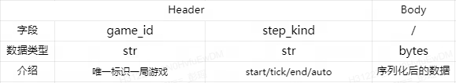

# Bray强化学习推理训练框架

Bray for based on ray and better than ray

## 定位

针对分布式强化学习在游戏场景下的落地进行优化，主要解决以下几个痛点问题：

1. 线上推理和离线训练框架不统一，存在较大的迁移成本
2. 游戏接入困难，涉及到多方联调

解决的办法是：

1. 规范化游戏AI强化学习的接入的流程
2. 提供简单干净的API，让游戏接入、算法调优、性能优化解耦

架构图（初版）：


具体的，下面是详细的游戏接入流程：

## 推理接入流程

这个阶段的目标是跑通游戏服务器和游戏AI机器人交互过程，同时也为后续的强化训练打下基础。

### 一、Gamecore接入

在真实的游戏业务场景下，Gamecore和Actor的软件依赖、算力需求、部署方案都有巨大的差异，本着通用性的原则，它们间的接口设计为Http协议的网络传输。

Http协议的完整定义如下：

#### 1. 请求包：



Header中的 `step_kind` 用于区分有状态和无状态服务场景，有状态情况下请求的顺序是 `start` -> `tick` -> `...` -> `tick` -> `end` ，无状态下固定为 `auto` 就行。

> 强化训练过程中需要知道完整的trajectory序列所以一般都要求有状态，而为了让推理和训练复用同一套代码（降低接入成本、保证迁移正确性），线上推理也都尽量使用有状态服务。

Http的body为任意数据，框架本身不会对其解析，Gamecore和Actor协商好序列化方式（json、protobuf）后，在Gamecore中进行序列化，在Actor中进行反序列化。

#### 2. 回复包：

回复仅包含Http Body，里面是Actor序列化后返回的数据。同样是和Gamecore协商好序列化方式。

#### 3. Gamecore接入示例

[Python下的Gym Atari例子](./bray/benchmark/atari/gamecore.py)

### 二、Model接入

Model指的是模仿学习或强化学习的模型，算法同学设计好网络结构后，交由框架进行优化。其中自动化部分包括计算图优化、算子优化、量化等，另外还有模型剪枝、蒸馏等需要手动调整。优化后的模型将会进行正确性验证，对比前后输出的绝对、相对误差。

#### 1. 模型优化流水线

#### 2. 模型接入示例

[Python下的Gym Atari简单PyTorch模型](./bray/benchmark/atari/model.py)

### 三、Actor接入

Actor指的是强化学习中和环境交互，采样得到Replay的有状态执行单元，负责将Gamecore中的结构化状态（敌人、地图、Boss）转化为模型向量输入（numpy array形式），以及将模型输出转为Gamecore识别的结构化指令，一些模型无法实现的决策树逻辑也放在这里。

Actor是Python中的一个类，暴露以下三个接口：

```python
@dataclasses.dataclass
class Agent:
    """
    Agent代表了Actor中的一个智能体，这里定义了它的基本属性
    """

    remote_model: RemoteModel
    remote_buffer: RemoteBuffer


class Actor:
    """
    Actor是一个有状态服务接受来自Gamecore的step调用，调用的顺序是：
    start(__init__) -> tick -> tick -> ... -> end
    """

    def __init__(
        self, agents: dict[str, Agent], config: any, game_id: str, data: bytes
    ):
        """
        初始化一个新的Actor，当一局新的游戏开始时，会调用这个方法
        Args:
            agents: 一个字典，key是agent的名字，value是agent的实例
            config: 一个任意的配置对象，由RemoteActor传入
            game_id: 一个唯一的游戏ID，由Gamecore传入
            data: 一个任意的字节串，由Gamecore传入，通常是空的
        """
        raise NotImplementedError

    def tick(self, data: bytes) -> bytes:
        """
        执行一步游戏，由Gamecore调用，在这里需要执行以下操作：
        1. 从data中解析出游戏状态
        2. 调用agent的remote_model.forward方法，获取action
        3. 将action序列化为字节串，返回给Gamecore
        4. 收集trajectory，将其push到agent的remote_buffer中
        Args:
            data: 一个任意的字节串，由Gamecore传入，通常是游戏状态
        Returns:
            一个任意的字节串，通常是序列化后的action
        """
        raise NotImplementedError

    def end(self, data: bytes) -> bytes:
        """
        游戏结束时调用，由Gamecore调用，在这里需要执行以下操作：
        1. 从data中解析出游戏状态（通常是最后一帧的reward）
        2. 终止收集trajectory，将其push到agent的remote_buffer中
        3. 进行一些清理工作
        Args:
            data: 一个任意的字节串，由Gamecore传入
        Returns:
            一个任意的字节串，通常是空的，或者一些统计信息
        """
        raise NotImplementedError
```

### 四、本地测试和联调

Gamecore/Model/Actor可以并行开发，每个组件可以单独测试：

#### 1. Gamecore

启动 [fake_actor.py](./bray/fake_actor.py) ，在里面的config中配置：

```python
config = {
    "fake_actor_tick_return": b"fake_actor_tick_return",
    "fake_actor_end_return": b"fake_actor_end_return"
}
actor_port = 8000
```

再启动需要测试的Gamecore连接到该Actor

#### 2. Model

Model的测试示例：

```python
import bray
import ray

model = MyModel()   # tf/torch model

remote_model = bray.RemoteModel("model1", model)

inputs = {
    "image": np.array([1, 2, 3], dtype=np.float32)
}

outputs = ray.get(remote_model.forward(inputs))
print(outputs)
```

#### 3. Actor

启动 [fake_gamecore.py](./bray/fake_gamecore.py) ，在里面的config中配置：

```python
config = {
    "fake_gamecore_step_start_data": b"fake_gamecore_step_start_data",
    "fake_gamecore_step_tick_data": b"fake_gamecore_step_tick_data",
    "fake_gamecore_step_end_data": b"fake_gamecore_step_end_data",
}
actor_url = "http://localhost:8000/step"
```

再启动需要测试的Actor，启动后FakeGamecore会自动连接过来并不间断发送请求。

## 训练接入流程

### 一、Trainer接入

### 二、Buffer接入

### 三、高级训练方法