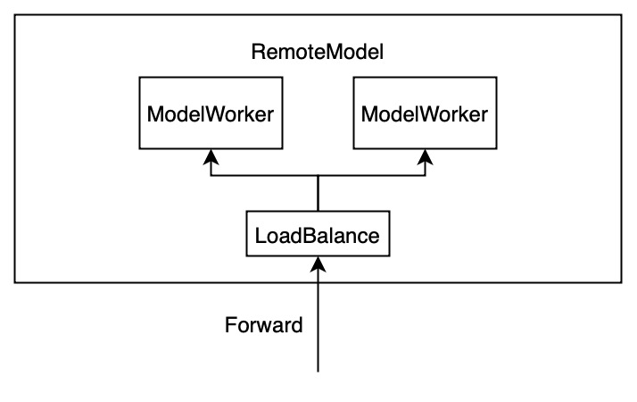
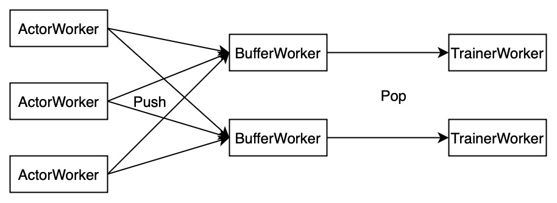
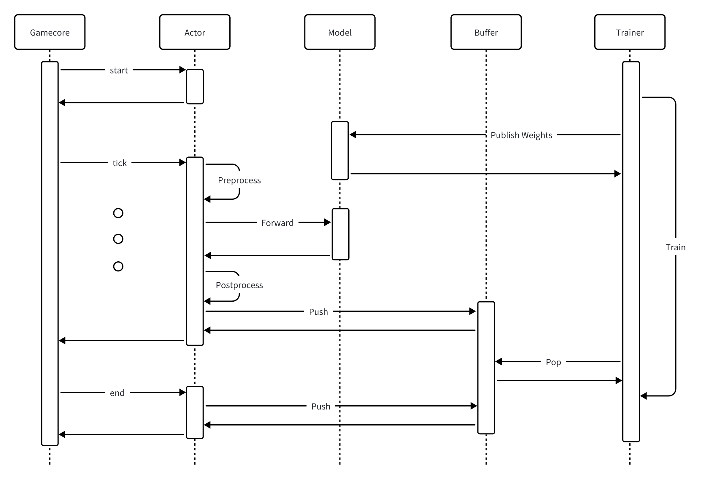
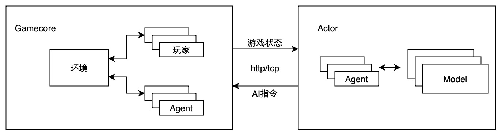
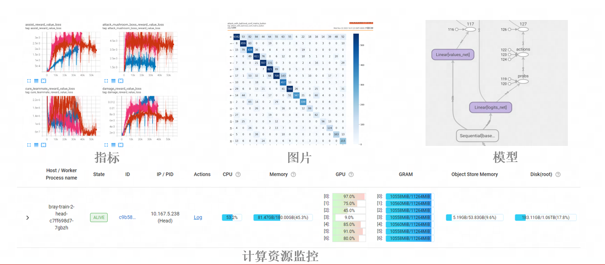
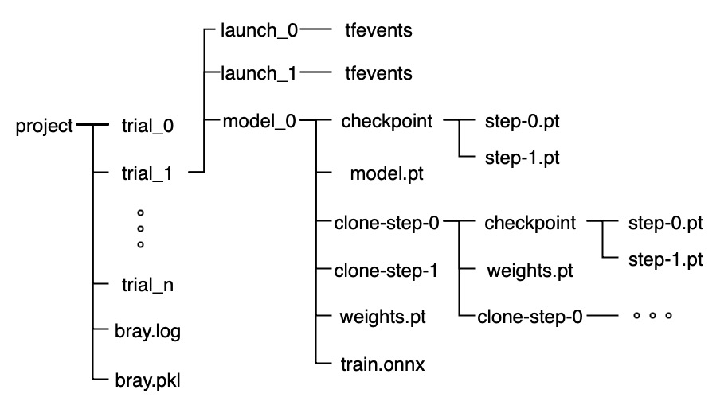
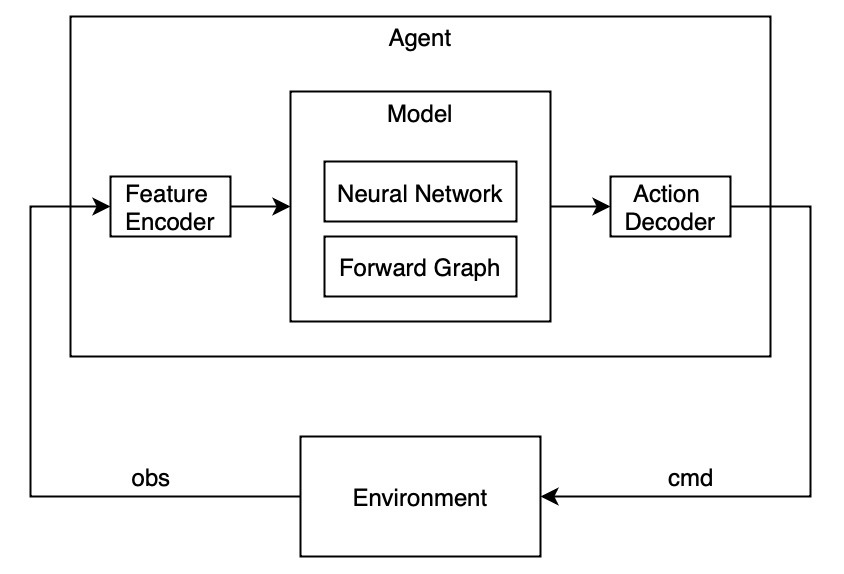
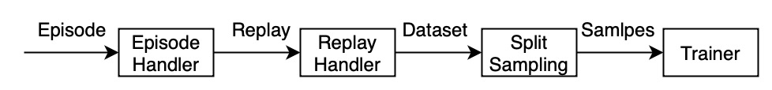

# 分布式强化学习训练部署框架--Bray

Bray for based on Ray and better than Ray!

## 定位

现有的强化学习框架有很多，比如 Ray（RLlib）、OpenAI Baselines、PyMARL 等，这些框架主要是为实验和研究设计的，在实际业务中常常会遇到以下痛点：

1. 强化学习环境接入困难

以典型的游戏场景为例，游戏逻辑代码通常是用 C++ 编写，通信代码使用 Golang，而 AI 算法代码则是 Python。由于这些代码对操作系统和软件依赖存在巨大差异，导致了许多额外的工程开发工作。

2. 训练和部署阶段分离，导致较高的迁移成本

将训练好的模型部署并交付时，需要考虑服务的高并发、低延迟和高可用性，而训练框架无法满足这些要求。通常的做法是使用部署框架（如 Triton、TorchServe 等）进行模型部署，并重写特征的前处理和后处理逻辑。

实际业务中，还需要额外考虑模型的量化、移动端部署、正确性校验等，这些繁琐的流程会极大拖慢算法迭代速度。

3. 性能差，难以高效扩展到分布式系统

大多数强化学习框架是从算法视角设计的，为了算法的完整性往往牺牲了性能。尤其当训练规模扩大到数百台机器、数万核 CPU 和数千张 GPU 时，性能瓶颈导致资源利用率低下。

4. 灵活性差，不易于算法拓展

真实的业务场景无法完美适配现有的强化学习算法，存在许多定制化需求，这要求训练框架足够扁平化（这也是 PyTorch 相较于 TensorFlow 的优势之一）。面对高度封装的算法库，除了需要花费大量时间学习外，修改起来也会面临牵一发而动全身的困境。

为此，Bray 框架从业务落地的角度出发，为强化学习训练和部署提供一站式解决方案。具体而言，Bray 框架有以下特点：

1. 标准化的接口和模块化设计

强化学习中的概念包括 Environment、Agent、Model、Replay、Algorithm 等，Bray 框架在此基础上进行工程化封装，提出了 Gamecore、RemoteActor、RemoteModel、RemoteBuffer、RemoteTrainer 等组件。


组件之间通过标准化接口进行通信，组件内部高度封装，可以单独使用。此外，所有 Remote 组件都运行在 Ray 集群中，具备负载均衡和横向拓展的能力。

2. 高性能和可扩展

Bray 在众多强化学习业务落地中遇到各种性能瓶颈，并积累了大量的性能优化手段。

例如，在 MOBA 游戏的训练和部署中，由于 Agent 的决策频率高、特征数量大，网络 IO 成为瓶颈。传统的数据压缩算法难以解决这个问题，Bray 研发了差分编码算法，以增量的形式发送数据。

又比如，在棋牌游戏的训练中，训练样本数量多但单个样本很小，导致 Trainer 的组批成为瓶颈。为此，Bray 将组批和训练拆分为多进程，并通过共享内存方式通信。

在实际测试中，Bray 能够在 100 台机器规模下，稳定不间断训练 7*24 小时，样本的吞吐率高于 100 万帧/秒。

3. 支持多种算法

为了提高易用性和降低上手难度，Bray 在算法侧尽可能做减法，优先支持经过实践验证、简单有效的算法。

强化学习算法包括 PPO、IMPALA、SAC 等，SelfPlay 算法包括 Champion、League 等。

用于游戏 AI 智能体的难度分级、风格拟人化的算法有 ModelPool、模仿和强化学习结合等。

4. 提供丰富的[模板](./template/README.md)

除了使用 Bray 提供的基本分布式组件（RemoteModel、RemoteActor 等）搭建机器学习流程外，还可以直接基于预定义的模板快速进行训练和部署的开发。

5. 训练和部署无缝迁移

得益于组件化设计，训练好的模型无需任何代码修改即可完成[导出、量化、正确性校验和部署](./deploy/README.md)。

## 环境依赖

训练请使用镜像： [开发镜像](./docker/dev.dockerfile) ，部署请使用镜像： [部署镜像](./docker/cpu.dockerfile)

也可以直接使用pip安装： `pip3 install git+https://github.com/onlyrobot/bray.git`

## RemoteXxx 和 XxxWorker

以 Remote 开头的组件都具备分布式能力，例如 RemoteModel 和 RemoteBuffer，它们运行在 Ray 集群中，包含多个 Worker，每个 Worker 代表一个 Model 或 Buffer 实例。

我们可以像使用本地 Model 和 Buffer 一样调用它们的 Forward 和 Push 方法，这些方法会被负载均衡到具体的 Worker，并返回执行结果。



在创建 RemoteXxx 时，可以指定包含的 Worker 数量，以及每个 Worker 占用的 CPU、GPU、内存资源。

## [RemoteModel](./bray/model/README.md)

RemoteModel 封装了一个 PyTorch 模型，除了可以像使用本地模型一样进行推理外，还附加了以下功能：

1. 权重发布和订阅

通过权重发布接口，可以同时更新所有 ModelWorker 实例的权重，就像本地调用 PyTorch Module 的 set_weights 方法一样。

2. 检查点管理、权重版本管理

每次发布权重时，模型的版本号会自动增加，并定期将当前权重保存到磁盘。所有版本的模型会组成一个模型池，通过 `clone` 接口可以在任意版本上 Clone 出一个新的 RemoteModel。这种机制可以方便地实现 SelfPlay 和 League 训练。

为了提高推理效率，RemoteModel 内部集成了包括负载均衡、动态批处理和算子优化等功能：

1. ModelWorker 间的负载均衡

RemoteModel 的推理请求会被均匀地分发到所有 Worker 进程，并根据不同 Worker 的所在机器和负载情况动态调节。

2. 动态批处理

当同一时间段内有多个请求时，会动态攒批，最大批次大小、请求的排队时间、Batch Size Padding 都可以通过参数调节。

3. 计算图和算子优化

RemoteModel 内部封装了 Onnx 和 TensorRT，通过选项可以控制是否将 PyTorch 导出为 Onnx 格式，并进一步选择是否进行量化和使用 TensorRT 推理后端。

RemoteModel 可以单独启动，向外暴露端口提供模型服务，也可以与 RemoteTrainer 一起搭建强化学习训练流程，因此以上性能优化在推理和训练阶段都可以使用。

## [RemoteBuffer](./bray/buffer/buffer.py)

Buffer 的作用是存放经验回放（Replay），而 RemoteBuffer 是一个分布式的经验回放池，向外提供 `push` 和 `pop` 两个方法。

一个典型的场景是多个采样进程同时向 RemoteBuffer 中 push 数据，多个训练进程同时从 RemoteBuffer 中 pop 数据：



RemoteBuffer 也集成了负载均衡，确保所有 BufferWorker 的 Replay 数量近似。此外，RemoteBuffer 还承担了样本的组批和采样算法实现。

对于固定的数据集，可以直接以 Source 的方式添加到 RemoteBuffer，它们会自动加载并 push 到 BufferWorker。

## [RemoteTrainer](./bray/trainer/trainer.py)

RemoteTrainer 支持分布式数据并行（DDP）训练，并对训练 Pipeline 进行了以下优化：

1. 数据 Prefetch 和动态 Reuse

RemoteTrainer 从 RemoteBuffer 中 pop 数据并进行组批和预处理，整个过程在独立线程执行，通过 Prefetch 机制减少训练流程等待。

强化学习的训练数据是实时产生的，当数据产生速度低于训练速度时，可以动态地对当前数据进行重用（Reuse）。

2. 共享内存和 RDMA 优化

数据从 BufferWorker 到 TrainerWorker 通过共享内存传输，减少了不必要的内存拷贝。数据从内存到 GPU 的传输使用 RDMA 技术，通过预取（Prefetch）机制掩盖数据 I/O 和计算时间，从而提高整体性能。

3. 流式带权采样算法

部分强化学习算法需要对样本进行加权采样，因此我们实现了一个流式加权采样算法。在结合强化学习和模仿学习的训练过程中，也需要从多个 RemoteBuffer 中进行加权采样。

4. 通过梯度累加增大批次大小

批次大小影响训练的速度和效果，但批次大小往往受限于模型和显存大小。通过梯度累加实现了任意批次大小训练，为算法调优提供了便利。

## [RemoteActor](./bray/actor/README.md)

强化学习中 Actor 执行的是 Agent 和 Environment 的交互逻辑，在这个过程中不断收集 Episode 并 Push 到 RemoteBuffer 中。

一个典型的强化学习过程如下：



这里的 Gamecore 对应 Environment，它通过 http/tcp 协议与 Actor 通信，按照 start->tick->...->tick->end 的顺序发送请求数据包。

区别于 Gym Environment 的 reset 和 step 接口，这里的 Gamecore 是请求的主动发起方，这样做的目的是尽可能解耦 Environment 和 Actor，并保证训练和部署的交互方式一致。

RemoteActor 封装了 Actor，用于实现 Actor 的并行计算。一个 RemoteActor 包含多个 ActorWorker，一个 ActorWorker 包含多个 Actor，每个 Actor 是一个有状态服务，响应 Gamecore 请求。



为了避免 I/O 等待，ActorWorker 使用 Python 的协程来并行处理请求。RemoteModel 的 Forward 接口和 RemoteBuffer 的 Push 接口也支持协程调用。

为了更好地支持多智能体训练，Actor 中引入了面向智能体编程（AOP）范式，每个 Agent 只需实现 `on_tick` 和 `on_episode` 两个方法。

交互过程中产生的 Episode 将会被统一收集汇总，用于数据分析、模型训练和可视化渲染。

## [RemoteServer](./bray/actor/README.md)

RemoteServer 用于向外暴露服务，支持 http/tcp 协议。相较于 Ray Serve，它更加轻量且性能优越，相较于 FastAPI、Flask 等 Python 服务框架，它更贴合机器学习场景，并支持多种负载均衡策略。

RemoteServer 支持有状态和无状态的服务，客户端可以通过 http 发起请求，也可以使用配套的 [SDK](./client/cpp/client.h) 进行调用。

## [指标、日志和可视化](./bray/master/master.py)

在分布式强化学习中，指标分为框架层面的指标（数据吞吐率、资源利用率等）、算法层面的指标（loss 等）和业务层面的指标（奖励、胜率等）。Bray 统一用标签（label）来区分它们。

从指标的统计方式上又可以分为均值、求和、分位数、最大值、最小值等，Bray 用统一的接口支持不同类型指标的输出和查询。

Bray 在训练阶段使用 Tensorboard 作为可视化工具，通过自定义横坐标方便地进行实验效果对齐。在部署阶段，Bray 暴露数据查询接口，供 Prometheus、Grafana 等数据收集和可视化工具使用。



Bray 在 Ray 的日志管理系统基础上，额外加入了全局的日志输出接口作为补充。

Bray 除了支持 Scalar、Histogram、Image、Model、Video 的可视化外，还支持对强化学习的 Episode 渲染。

## 实验管理和模型管理

实验管理需要解决以下问题：确保不同实验的代码和数据相互隔离，持久化保存实验过程中生成的指标、日志、模型和权重，并能够对不同实验的效果进行横向对比。

Bray 基于文件系统做实验管理和模型管理，文件目录的组织形式如下：



根目录为项目名（project），其下包含全局的日志文件（bray.log）、全局的数据文件（bray.pkl）以及多个实验目录（trial）。

在实验目录下，又包含模型目录（model）和启动目录（launch），模型目录是 RemoteModel 生成的，其中保存了模型的定义、权重、检查点、转换的 Onnx 模型和 Clone 的子模型。其中 Clone 的子模型也是一个 RemoteModel，因此存在递归的文件结构。

每次启动实验，都需要调用 Bray 的初始化函数（内部调用了 ray.init 函数）：

```python
bray.init(project="./project", trial="trial")
```

如果指定的 trial 不存在，则会创建新的实验，否则会在已有实验下创建新的启动目录（launch），启动目录下是 Tensorboard 的 Event 文件，可以通过以下命令查看：

```bash
tensorboard --logdir ./project --port 6006 --bind_all
```

在分布式环境下，利用 ray 的[环境依赖配置](https://docs.ray.io/en/latest/ray-core/handling-dependencies.html)可以实现代码和数据的隔离：

```python
bray.init(project="./project", trial="trial", runtime_env={"working_dir": "."})
```

## [算法库](./algos/README.md)

Bray 按照以下方式对算法（Algorithm）库进行组织和分类：

1. Neural Network

基本的神经网络组件，如 MLP、CNN、LSTM、ResNet、Transformer、Embedding 等。多数情况下 PyTorch 的神经网络库可以满足需求。

当需要定制神经网络的参数（Activation、Dropout、Mask等），或者自定义权重的初始化方法，或者要搭建更复杂的神经网络时可以添加到库中。

2. Model

这里的模型尤指 PyTorch Module，其定义了神经网络和计算图。区别于“更复杂的神经网络”的地方是，模型和具体任务相关，比如分类模型、预测模型、决策模型。

3. Loss Function、Optimizer、Trainer：损失函数、优化器和训练器

4. Feature Encoder

特征编码器，用于将 Environment 观测到的原始数据转化为机器学习更容易理解的特征，包括 One-Hot Encoding、Binary Encoding、Spatial Encoding 等。

5. Action Decoder

动作解码器，用于将模型输出的向量（Tensor）转化为 Agent 的动作指令，通常是在环境规则约束下从动作分布中采样。

6. Agent

Agent 的输入是观测数据，输出为动作指令，内部包含了 Feature Encoder、Model 和 Action Decoder，一个 Environment 可能包含一个或多个 Agent。



7. Episode Handler

Agent 和 Environment 的交互序列组成 Episode，之后会被 Episode Handler 处理。以 PPO 算法为例，Episode Handler 中包含了奖励计算和通用优势估计（GAE）。

8. Replay Handler、Dataset、Split、Sampling

Agent 的 Trajectory 被放入经验回放池，经 Replay Handler 转为 Dataset，Dataset再被切割（Split）、采样（Sampling）用于最终的训练（Training）、测试（Test）和评估（Evaluate）。



9. Training Process

训练流程（Training Process）包含完整的数据流和控制流，不同算法在 Agent 数量、Replay 的合并策略、模型的参数更新上可能存在差异。

比如SelfPlay训练流程中包含多个 Agent，Agent 之间存在博弈或合作关系，它们的 Replay 会根据情况加入到经验回放池中，它们的模型参数也会动态更新。

## [Template 模版](./template/README.md)

模版是预定义的训练和部署流程，其包含组件及对应的配置信息，通过模版可以加速项目接入，提高代码复用性。

目前预定义了三种机器学习模版：强化学习、模仿学习、模仿和强化学习相结合，分别对应到[这个代码目录](./template/)下的三个配置文件。

所有的模版都是由以下七个组件组成的，一个模版可以包含任意类型和数量的组件：

1. Model：指 PyTorch 模型，被用于推理和训练，支持权重管理和检查点管理
2. Agent：代表了和环境交互的智能体，被添加到 Actor 中
3. Buffer：缓冲区，可以向其中添加数据源或者 Push 数据
4. Source：数据源，可以是文件、网络、对象存储等的封装，以迭代器的形式加入到缓冲区（Buffer）中
5. Actor：定义了智能体和环境的交互逻辑，也是部署时对外暴露的AI服务
6. Trainer：封装了模型（Model）、缓存区（Buffer）和训练算法（Algorithm）
7. Render：渲染器，用于渲染 Actor 中生成的 Episode

## Gym Atari 示例

一个基本的强化学习任务需要包括 Gamecore、Model、Actor、Trainer 四个组件，其中 Trainer 只在训练阶段使用。

Bray 很好的将这四部分解耦开来，支持每个组件的独立开发、测试和验证，并在训练和部署阶段进行集成。[完整示例](./benchmark/atari/README.md)

## 未来规划

作为一个传统强化学习框架，Bray的核心组件已经迭代的相对成熟且稳定了，但是在大模型场景，还有部分欠缺，下面列出了未来的研发计划：

1. 支持大模型的强化训练，支持多Agent和工具调用
2. 支持可视化建模，用图形化界面完成强化学习的训练和部署
3. 完善算法库，提供更多垂类模版，和开源社区结合更加紧密，为SGLang、VLLM、MS-Swift提供更多的适配
4. 移除Ray的依赖，加入集群管理、环境管理、任务调度、模型编排的能力

## License

The MIT License(MIT). Copyright (c) 2024 PengYao. All rights reserved.