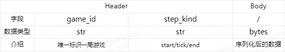

# 分布式强化学习训推一体化框架Bray

Bray for based on ray and better than ray

## 定位

针对分布式强化学习在游戏场景下的落地进行优化，主要解决以下几个痛点问题：

1. 线上推理和离线训练框架不统一，存在较大的迁移成本
2. 游戏接入困难，涉及到多方联调

解决的办法是：

1. 规范化游戏AI强化学习的接入的流程
2. 提供简单干净的API，让游戏接入、算法调优、性能优化解耦

架构图：


## 环境依赖

训练请使用镜像： `hub.fuxi.netease.com/zhiqi-gameai/bray/bray:dev`

部署请使用镜像：

新的游戏项目接入时，在根目录下以项目名创建文件夹，文件组织形式参考 [Atari Example](./benchmark/atari/)


## 模块化接入

一个强化学习任务需要定制化Gamecore、Model、Actor、Trainer这四个组件，其中Trainer只在训练阶段使用。

Bray很好的将这四部分解耦开来，支持每个模块独立开发、测试和验证，最后无缝式集成。下面是具体的接入流程：

### 1. Gamecore接入

Gamecore指的是强化学习中的仿真环境。在真实的游戏业务场景下，Gamecore和Actor的软件依赖、算力需求、部署方案都有巨大的差异，本着通用性的原则，它们间的接口设计为Http协议。Gamecore为请求发起方，Actor为服务端。

#### Http协议的完整定义如下：



Header中的 `step_kind` 用于标识当前 step 的类型，一局游戏的请求顺序是 `start` -> `tick` -> `...` -> `tick` -> `end` 。

> 强化训练过程中需要知道完整的trajectory序列所以一般都要求有状态，而为了让推理和训练复用同一套代码（降低接入成本、保证迁移正确性），线上推理也都使用有状态服务。

Http的body为任意数据，框架本身不会对其解析，Gamecore和Actor协商好序列化方式（json、protobuf）后，在Gamecore中进行序列化，在Actor中进行反序列化。

> 注意： 回复包的Header被忽略，为空

#### 接入流程

1. 启动 [FakeActor](./bray/fake/fake_actor.py) ，可以在config中修改FakeActor的行为：

```python
config = {
    "fake_actor_tick_return": b"fake_actor_tick_return",
    "fake_actor_end_return": b"fake_actor_end_return"
}
actor_port = 8000
```

2. 启动Gamecore连接到该Actor，按照上面的 Http 协议发出请求，跑通流程
3. 逐渐增加 Gamecore 的实例数量，得到CPU、内存和网络的压测数据

#### Gamecore的最佳实践

* [Python下的Gym Atari使用requests库和多线程](./benchmark/atari/gamecore.py)
* [C++待完善]()

### 2. Model 接入

Model指的是深度学习模型。算法同学设计好网络结构后，交由框架进行推理优化、权重检查点管理。

Model接入主要是为了保证以下几点：

* 模型能够正常地被序列化和反序列化，在分布式环境和异构计算设备上能够正确的输出结果
* 框架集成的计算图优化、算子优化、量化等优化pipeline能够跑通，且通过正确性验证
* 模型能够被正确的 `get_weights` 和 `set_weights` 

模型接入流程非常简单：[Gym Atari的简单PyTorch模型](./benchmark/atari/model.py)

```python
remote_model = bray.RemoteModel(
    name="atari_model", 
    model=AtariModel(),
    forward_args=(np.random.randn(42, 42, 4).astype(np.float32),),
    )
# 以下命令可以在集群中任何地方执行
# 在 Actor 中用 await remote_model.forward(inputs)
outputs = asyncio.run(remote_model.forward(inputs))
model = remote_model.get_model()
weights = bray.get_torch_model_weights(model)
remote_model.publish_weights(weights)
```

> 注意：
> * 这里的 `forward_args` 和 `forward_kwargs` 的类型分别是 `tuple[np.ndarray]` 和 `dict[str: np.ndarray]` ，传给 `AtariModel().forward` 函数时，会经过组Batch和转Torch Tensor，所以在 `AtariModel().forward` 中看到的是转换后的增加一个Batch维度的 `NestedTensor`。
> * `AtariModel().forward` 输出应该为一个或者多个 Torch Tensor 或者 Torch Tensor 的字典，且包含Batch维度，Bray会自动缩减掉该维度并且转为 `np.ndarray` 返回。

### 3. Actor接入

强化学习中的Actor一般指的是和环境交互，采样得到Replay的有状态执行单元。它的具体功能包括：

* 充当Server被Gamecore调用
* 将Gamecore发过来的结构化状态（敌人、地图）转为模型的向量输入（numpy.ndarray）
* 调用模型的forward接口，得到模型输出
* 将模型输出转为Gamecore识别的结构化指令并返回给Gamecore
* 收集trajectory，计算奖励，push到Buffer中
* 处理模型不擅长的决策树逻辑

框架已经实现了Server和网关路由的功能，用户需要继承 [Actor基类](./bray/actor/base.py) ，实现其中的三个方法，并交给RemoteActor调度。

Actor接入依赖Gamecore和Model，可以使用FakeGamecore和FakeModel来解耦。

[Gym Atari的Actor示例](./benchmark/atari/actor.py)

```python
# 初始化模型
bray.RemoteModel(name="atari_model", model=AtariModel())
# 部署AtariActor服务，暴露8000端口
remote_actor = bray.RemoteActor(port=8000)
remote_actor.serve(Actor=AtariActor, model="atari_model", buffer="atari_buffer")
bray.run_until_asked_to_stop()
```

### 4. Trainer接入

Trainer从Buffer中获取Replay进行训练Model，用户需要实现一个train函数，交给RemoteTrainer进行分布式调度。

Trainer接入主要考虑以下几点：

* 用户实现的train是否支持分布式并行训练，是否支持GPU训练
* 强化训练过程中Model的权重版本号能否正常增长
* 训练过程中的指标是否正常（loss、reward等）

[Gym Atari的Trainer示例](./benchmark/atari/trainer.py)

```python
# 初始化模型
bray.RemoteModel(name="atari_model", model=AtariModel())
# 启动FakeBuffer自动地向Buffer推送数据
bray.fake.FakeBuffer(name="atari_buffer")
# 开始验证训练过程是否正常，中途会输出指标到tensorboard和日志到终端
remote_trainer = bray.RemoteTrainer(use_gpu=False, num_workers=2)
remote_trainer.train(train=train_atari, 
    model="atari_model", buffer="atari_buffer", batch_size=8,
    weights_publish_interval=1, num_steps=100000)
bray.run_until_asked_to_stop()
```

## 启动脚本

将上面的Gamecore、Actor、Model、Trainer集成到一起：

[Gym Atari的训练脚本](./benchmark/atari/launch.py)

[Gym Atari的部署脚本](./benchmark/atari/deploy.py)

## 实验管理

bray基于分布式文件存储做实验管理，通过下面的 `bray.init` 函数初始化当前训练任务：

```python
# 将会创建 ./atari-pengyao/ppo-v0 目录
bray.init(project="./atari-pengyao", trial="ppo-v0")
```

当前session创建的所有的Model、Actor、Trainer、Buffer都将位于该实验目录下。

使用 tensorboard 查看训练指标：

```bash
tensorboard --logdir ./atari-pengyao/
```

## 高级训练

### SelfPlay

### League