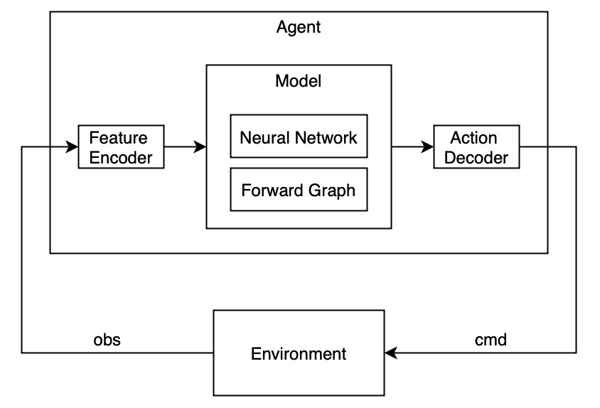
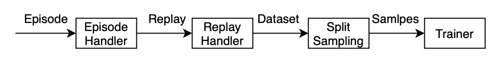

# 算法库

Bray 按照以下方式对算法（Algorithm）库进行组织和分类：

1. Neural Network

基本的神经网络组件，如 MLP、CNN、LSTM、ResNet、Transformer、Embedding 等。多数情况下 PyTorch 的神经网络库可以满足需求。

当需要定制神经网络的参数（Activation、Dropout、Mask等），或者自定义权重的初始化方法，或者要搭建更复杂的神经网络时可以添加到库中。

2. Model

这里的模型尤指 PyTorch Module，其定义了神经网络和计算图。区别于“更复杂的神经网络”的地方是，模型和具体任务相关，比如分类模型、预测模型、决策模型。

3. Loss Function、Optimizer、Trainer：损失函数、优化器和训练器

4. Feature Encoder

特征编码器，用于将 Environment 观测到的原始数据转化为机器学习更容易理解的特征，包括 One-Hot Encoding、Binary Encoding、Spatial Encoding 等。

5. Action Decoder

动作解码器，用于将模型输出的向量（Tensor）转化为 Agent 的动作指令，通常是在环境规则约束下从动作分布中采样。

6. Agent

Agent 的输入是观测数据，输出为动作指令，内部包含了 Feature Encoder、Model 和 Action Decoder，一个 Environment 可能包含一个或多个 Agent。

7. Episode Handler

Agent 和 Environment 的交互序列组成 Episode，之后会被 Episode Handler 处理。以 PPO 算法为例，Episode Handler 中包含了奖励计算和通用优势估计（GAE）。

8. Replay Handler、Dataset、Split、Sampling

Agent 的 Trajectory 被放入经验回放池，经 Replay Handler 转为 Dataset，Dataset再被切割（Split）、采样（Sampling）用于最终的训练（Training）、测试（Test）和评估（Evaluate）。

9. Training Process

训练流程（Training Process）包含完整的数据流和控制流，不同算法在 Agent 数量、Replay 的合并策略、模型的参数更新上可能存在差异。

比如SelfPlay训练流程中包含多个 Agent，Agent 之间存在博弈或合作关系，它们的 Replay 会根据情况加入到经验回放池中，它们的模型参数也会动态更新。