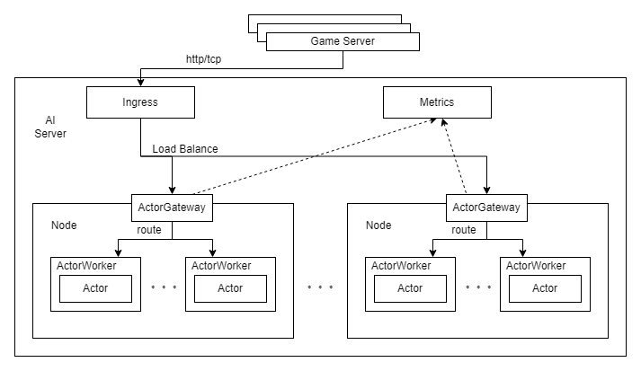
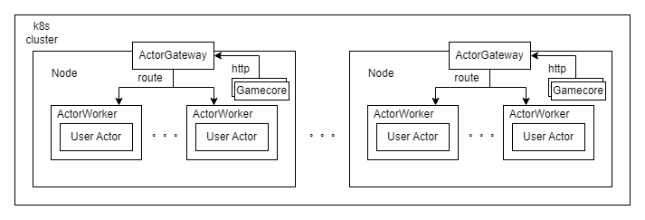

# Bray RemoteActor架构和接口设计
Bray的RemoteActor封装了用户的Actor类，向外提供了网关路由、分布式调度的功能。这些功能都是基于Ray的相关特性来实现，并且能够很好的和其他组件RemoteModel、RemoteBuffer相结合。此外RemoteActor还向用户暴露了控制接口，和监控指标，方便实时修改服务状态，动态更新。
为了实现以上功能，RemoteActor包含了ActorGateway、ActorWorker两个概念。
## 一、架构图

## 二、ActorGateway
ActorGateway充当的是Gamecore和ActorWorker间的网关角色，接受来自Ingress(nginx)转发过来的http协议包，并解析Header中的以下字段：

| 字段名    | session   | step_kind | key | time | token |
|----------|---------|----------|--------|----------|----------|
| 数据类型  | str   | str    | str   | str    | str    |
| 介绍      | 标识ID  | start/tick/stop | 鉴权 | 鉴权 | 鉴权 |

Header中的 `step_kind` 用于标识当前 step 的类型，一局游戏的请求顺序是 `start` -> `tick` -> `...` -> `tick` -> `stop` 。
key、time、token用于线上服务的鉴权，强化训练时保持为空。
之后ActorGateway会根据session将请求路由到对应的ActorWorker上面，http协议中的Body将会被ActorWorker中的用户自定义Actor解析。
ActorGateway是一个Ray Serve Deployment，除了能够向外界暴露端口提供http服务以外，还支持跨节点的扩缩容，在强化学习训练阶段，如果Gamecore和RemoteActor位于同一集群，可以让Gamecore连接到所在节点对应的ActorGateway，降低网络传输压力。

此外，这里还会收集游戏对局相关的指标，阻止非法连接和在负载压力过高时拒绝连接。
具体的指标有：当前对局数，平均对局时间，每分钟对局次数，每分钟tick数异常中断次数
## 三、ActorWorker
ActorWorker由Ray Worker充当，是用来执行User Actor的独立进程。它的生命周期由ActorGateway管理。在部署阶段会评估一个ActorWorker的算力需求，确定资源分配的单位。
每当有一局新的游戏开始，ActorGateway会创建一个ActorWorker实例，ActorWorker再创建一个User Actor实例，这里需要注意一点的是，由于存在动态创建Python对象，所以不能修改原代码文件，否则会出现不一致。
用户提供User Actor必须满足Actor基类的定义，需要注意的一点是基类中的start、tick、stop接口被设计为Python协程的异步函数（asyncio），能够更好处理Actor中多智能体（Agent）并行计算，以及并行向RemoteModel发出请求的情况，此外由于ActorWorker运行在ray cluster中，所以能够方便地进行异步并行计算。
## 四、指标和查询接口
除了Bray框架集成的Tensorboard指标收集展示以外，ActorGateway还暴露给Prometheus指标查询接口：http://host:port/metrics