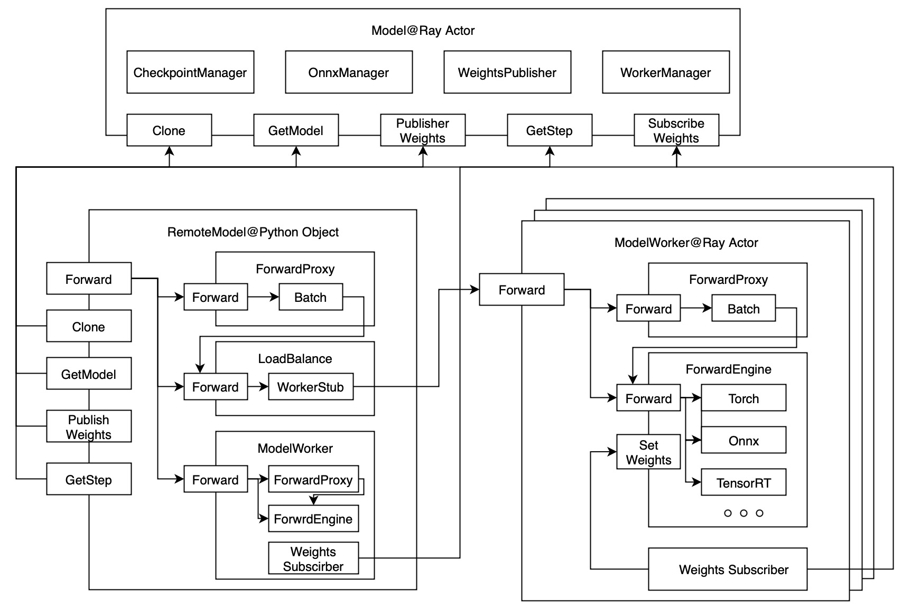

# RemoteModel

## 介绍

RemoteModel 是 Bray 的核心组件之一，被用来赋予 PyTorch 模型分布式能力。除了可以像使用本地模型一样进行推理外，还附加了以下功能：

1. 权重发布和订阅

通过权重发布接口，可以同时更新所有 ModelWorker 实例的权重，就像本地调用 PyTorch Module 的 set_weights 方法一样。

2. 检查点管理、权重版本管理

每次发布权重时，模型的版本号会自动增加，并定期将当前权重保存到磁盘。所有版本的模型会组成一个模型池，通过 `clone` 接口可以在任意版本上 Clone 出一个新的 RemoteModel。这种机制可以方便地实现 SelfPlay 和 League 训练。

为了提高推理效率，RemoteModel 内部集成了包括负载均衡、动态批处理和算子优化等功能：

1. ModelWorker 间的负载均衡

RemoteModel 的推理请求会被均匀地分发到所有 Worker 进程，并根据不同 Worker 的所在机器和负载情况动态调节。

2. 动态批处理

当同一时间段内有多个请求时，会动态攒批，最大批次大小、请求的排队时间、Batch Size Padding 都可以通过参数调节。

3. 计算图和算子优化

RemoteModel 内部封装了 Onnx 和 TensorRT，通过选项可以控制是否将 PyTorch 导出为 Onnx 格式，并进一步选择是否进行量化和使用 TensorRT 推理后端。

RemoteModel 可以单独启动，向外暴露端口提供模型服务，也可以与 RemoteTrainer 一起搭建强化学习训练流程，因此以上性能优化在推理和训练阶段都可以使用。

## 系统架构

RemoteModel 作为分布式组件，支持在 Ray 集群任意地方构造并使用。在内部，RemoteModel 由三个子部分组成，分别是：

1. RemoteModel：一个 Python Object，用户通过它来访问 RemoteModel 的所有功能
2. Model：一个 Ray Named Actor，其保存了当前 RemoteModel 的所有信息，在 Ray 集群共享
3. ModelWorker：模型真正部署的地方，支持本地（Local）模式和远端（Remote）模式

下面是 RemoteModel 的完整架构图：



每次构造 RemoteModel 实际上是图中的 RemoteModel@Python Object 对象，Model@Ray Actor 只有在第一次构造时才会创建。

ModelWorker 是模型真正部署的地方，当请求进来后，会根据具体情况进行排队、组批、推理等操作。图中的 ForwardEngine 是模型推理引擎，支持 PyTorch、Onnx 和 TensorRT 后端。

模型权重的发布和订阅是通过 Ray Actor Method Call 实现的，ModelWorker 向 WeightsPublisher 发起订阅请求，请求将会等待直到权重发生变化。为了降低网络传输量，这里采用了树形广播机制，同一节点通过共享内存获取权重。

图中的 ForwardProxy 被用于 Forward 请求的调度和组批，当 RemoteModel 构造时指定 proxy 模式时，会进行二级组批，即在本地先组一次批，在 ModelWorker 内部再组一次。

图中的 WorkerStub 负责向 Remote ModelWorker 发起 Forward 请求，请求的方式可以为 http 或 Ray Actor Method Call。

## 接口定义

RemoteModel 的主要接口包括：构造方法、Forward 方法、Clone 方法、发布权重方法、获取模型方法。

```python
def __init__(self, name: str, *args, **kwargs):
    """
    创建或者获取一个RemoteModel，如果已经存在同名的RemoteModel，则直接返回
    Args:
        name: 模型的名字，用于在Ray集群中标识模型
        model: 
    目前支持PyTorch模型，如果为None，则默认已经存在的同名模型
        forward_args: 
    模型forward的位置参数输入，用于初始化模型
        forward_kwargs: 
    模型forward的关键字参数输入，用于初始化模型
        checkpoint_interval: 
    模型的checkpoint间隔，单位step，默认10分钟保存一次
        max_batch_size: 
    模型的max_batch_size，默认为0，表示不额外组批次，负数表示固定批次大小
        num_workers: 
    模型的worker数量，为None会自动根据负载情况调整，默认为0
        cpus_per_worker: 
    每个worker的CPU核心数，默认为1
        gpus_per_worker: 
    每个worker的GPU数量，如果为0，则表示不使用GPU，默认为0
        memory_per_worker: 
    每个worker的内存大小，单位MB，默认为1024
        use_onnx: 
    默认不适用onnx优化，可选值为["train", "infer"]
        local_mode: 
    为True模型会在本地运行，否则在Ray集群中运行，默认为False
        override_model: 
    为True会覆盖已经存在的模型，设为False可以加速启动
        namespace:
    模型所在的 Ray 命名空间，通过这个选项可以使用其他命名空间下的模型
    """

async def forward(
    self, *args: NestedArray, batch=False, **kwargs: NestedArray
) -> NestedArray:
    """
    执行模型的前向计算，返回模型的输出，请注意batch维度的特殊处理
    Args:
        *args: 模型的位置参数输入，为一个或者多个 np.ndarray
        batch: 输入和输出是否包含batch维度，默认不包含
        **kwargs: 模型的关键字参数输入，为 np.ndarray 字典
    Returns:
        模型的输出，是一个或多个 np.ndarray
    """

def __call__(self, *args, batch=True, **kwargs):
    """同 self.forward，内部封装了async调用"""

@property
def step(self) -> int:
    """获取模型的最新版本号，每次调用 publish weights 会增加版本号"""

def get_model(self) -> torch.nn.Module:
    """
    获取被封装的原始模型，权重为最新权重，在Trainer里面会用到
    Returns:
        被封装的Pytorch模型，权重为最新的权重
    """

def clone(self, step: int = -1, name=None, **kwargs):
    """
    克隆一个新的RemoteModel，可以用于SelfPlay和League的多智能体对抗
    Args:
        step: 克隆的模型的版本号，-1表示最新版本
        name: 克隆模型的额外名字后缀，用于区分不同模型
        kwargs: RemoteModel的关键字参数
    Returns:
        克隆的RemoteModel，用法和RemoteModel一致
    """

def publish_weights(self, weights: NestedArray, step=-1):
    """
    发布模型的权重，会通知所有的ModelWorker更新权重
    Args:
        weights: 模型的权重，为一个NestedArray数组
        step: 权重的版本号，每次更新权重都需要增加版本号
    """
```

说明：接口定义中的 NestedArray 是 Bray 中定义的标准数据传输格式，[参考](../utils/nested_array.py)

## 使用示例

1. 默认构造参数下

```python
from bray import RemoteModel
import torch
    
forward_args = (
    torch.rand(10, 10).numpy(),
)

remote_model = RemoteModel(
    name="my_model", 
    model=torch.nn.Linear(10, 10),
    forward_args=forward_args
)

print(remote_model(*forward_args))
```

2. 使用本地 ModelWorker

```python
import torch, bray

bray.init(project="test", trial="test")
    
forward_args = (
    torch.rand(10, 10).numpy(),
)

remote_model = bray.RemoteModel(
    name="my_model", 
    model=torch.nn.Linear(10, 10),
    forward_args=forward_args,
    local_mode=True,
)

print(remote_model(*forward_args))
```

3. 使用 GPU 推理

```python
import torch, bray

bray.init(project="test", trial="test")
    
forward_args = (
    torch.rand(10, 10).numpy(),
)

remote_model = bray.RemoteModel(
    name="my_model", 
    model=torch.nn.Linear(10, 10),
    forward_args=forward_args,
    gpus_per_worker=1.0,
)

print(remote_model(*forward_args))
```

4. 设置批次大小

```python
import torch, bray

bray.init(project="test", trial="test")
    
forward_args = (
    torch.rand(10, 10).numpy(),
)

remote_model = bray.RemoteModel(
    name="my_model", 
    model=torch.nn.Linear(10, 10),
    forward_args=forward_args,
    max_batch_size=16,
)

print(remote_model(*forward_args))
```

5. 开启 onnx 优化

```python
import torch, bray

bray.init(project="test", trial="test")
    
forward_args = (
    torch.rand(10, 10).numpy(),
)

remote_model = bray.RemoteModel(
    name="my_model", 
    model=torch.nn.Linear(10, 10),
    forward_args=forward_args,
    use_onnx="infer",
)

print(remote_model(*forward_args))
```