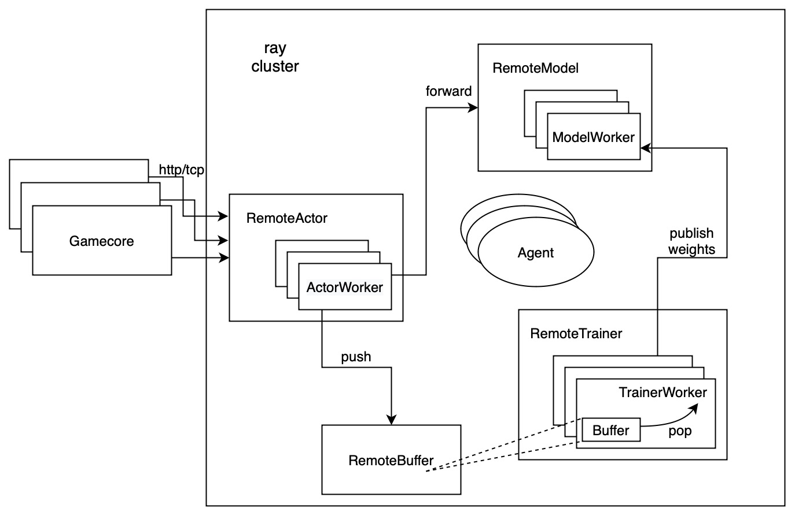
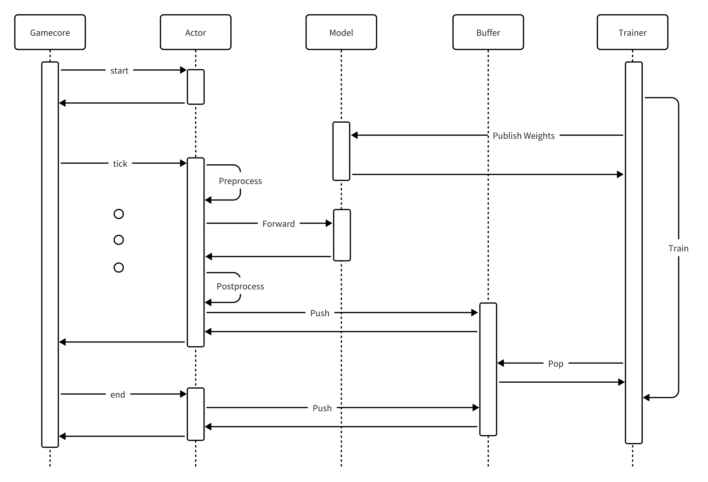
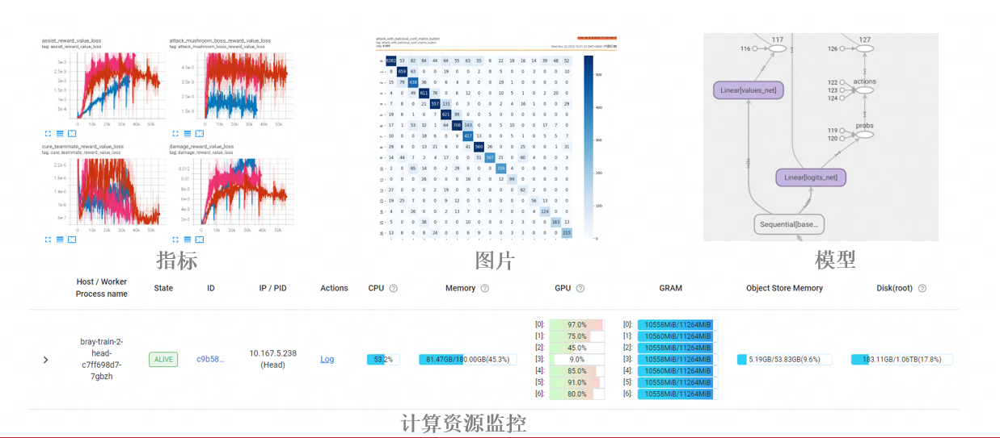

# 分布式强化学习训推一体化框架Bray
Bray for based on ray and better than ray
## 定位
游戏AI的训练离不开模仿学习和强化学习，而这些都依赖于海量的数据、算力，以及高效的训练算法。分布式强化学习框架就是要提供这样一个高效的训练平台，支持游戏仿真环境并行采样，支持流水线式数据处理，支持高吞吐低延迟的模型预测以及支持多机多卡并行训练。
现有的开源强化学习框架比如Ray(RLlib)、OpenAI Baselines、PyMARL等，更多的是实验和研究性质，满足了强化学习算法探索、效果对齐等需求，特点是通用性强，算法可拓展性高，但面对真实的游戏场景往往不够实用。
Ray(RLlib)中的游戏环境比如Gym、Mujoco都经过了标准化封装，能够很好的接入到各种强化学习算法，但是实际的游戏环境在软件依赖、接口、编程语言、调用关系上都存在巨大的差异，导致游戏接入过程中会遇到各种工程上的问题，比如依赖冲突、并发冲突、内存泄漏等。
OpenAI Baselines和PyMARL提供了高效的强化算法实现和多智能体训练范式，但分布式环境下无法支撑高并发地采样、多机多卡训练和容错，而这些是保证算法迭代效率和降低研发成本的关键。
为了解决以上问题，Bray面向真实的游戏AI落地进行优化，在算法侧做减法，保证框架的简单易于上手，同时用模块化设计理念保证了框架的高可用。具体地，Bray解决了以下几个痛点问题：
1. 统一训练和推理框架
游戏AI的研发上线往往经过训练和部署两个阶段，部署阶段的特征处理和模型推理逻辑是训练的子集，二者的代码可以复用。为了进一步降低训练到部署的迁移成本，保证迁移的正确性，Bray在框架层面支持了训练到部署的无缝迁移。
1. 规范化游戏AI的接入流程
一个游戏AI的接入涉及到游戏开发、算法对接、性能优化等，通过规范接入过程的流程和接口，Bray实现了各个模块的并行接入、测试和验证，缩短了游戏AI的接入周期。
1. 模块化设计和简单易用的API
Bray中明确定义了Actor、Model、Buffer、Trainer等概念，对应到Python中的类和模块，模块间充分解耦，让游戏接入、算法调优和性能优化可以独立进行。此外模块化设计保证了框架的高可拓展性，快速支持SelfPlay和League等多智能体训练。
## 架构图

Bray基于Ray开发，运行在Ray集群之上，主要包含RemoteActor、RemoteModel、RemoteTrainer和RemoteBuffer这几个分布式概念，每个概念都有自己的Worker进程。
这里的Gamecore位于Ray集群之外，运行的是游戏AI机器人、玩家以及环境的交互逻辑。训练过程中Gamecore不断将当前的观测状态发送给RemoteActor，接收来自RemoteActor返回的指令。
RemoteActor接受到来自Gamecore的结构化状态（玩家、BOSS、地图、奖励等）后，先进行预处理，转化为模型的输入，再调用RemoteModel的Forward接口，得到模型输出，最后将模型的输出转化为Gamecore能够识别的结构化指令并返回。RemoteActor不断循环这个过程，收集强化学习中的Trajectory，计算奖励并Push到RemoteBuffer中。

RemoteTrainer会不断地从BufferWorker中Pop经验数据进行模型训练，训练好的权重会实时同步到RemoteModel，完成完整的强化学习流程。
多智能体强化学习训练中，每个Agent都能自定义Model、Buffer和Trainer，从而实现复杂的训练流程。
## Gamecore和RemoteActor的通信接口定义
在真实的游戏业务场景下，Gamecore和Actor的软件依赖、接口、编程语言、调用关系上都存在巨大的差异，本着通用性的原则，它们间的接口设计为Http/TCP协议。Gamecore为请求发起方，Actor为服务端。

一局游戏中，Gamecore不断向Actor发送请求，根据当前游戏状态得到AI指令，Actor是RemoteActor的一个实例化，代表一个有状态服务。一个RemoteActor包含了多个ActorWorker，每个ActorWorker对应到一个Python进程。ActorWorker中用Python协程实现了多局游戏的并发。训练和部署阶段都暴露相同接口，保证训练和部署的统一。
在不同的游戏场景中，Gamecore包含玩家和AI数量是不确定的，因此发送给Actor的游戏状态和返回的AI指令也不同，一般情况下的每个玩家和AI的状态和指令如下：
### 游戏状态示例
| 编号 | 状态   | 详细描述                                       |
|----|------|---------------------------------------------|
| 1  | 坐标信息 | 可以获取场上每个玩家的坐标（绝对坐标），每个坐标是一个二元组或三元组   |
| 2  | 属性信息 | 可以获得玩家属性（浮点类型或整数类型）                             |
| 3  | 朝向信息 | 可以获取场上每个玩家的朝向，为一个实数，代表水平方向的角度或弧度         |
| 4  | 战斗信息 | 可以获得玩家的战斗信息                                      |
| 5  | 技能信息 | 可以获得玩家的节能信息(是否可用)                               |
###  AI指令示例
| 编号 | 作用     | 详细描述                                       |
|----|--------|---------------------------------------------|
| 1  | 使用技能或道具 | 是否让游戏 AI 角色使用技能或道具                  |
| 2  | 控制角色移动   | 控制游戏角色移动，包含上、下、左、右四个方向        |
## RemoteModel介绍
RemoteModel封装了一个PyTorch或者Tensorflow模型，实现了模型推理、权重订阅发布、检查点管理、模型导入导出等功能。
模型的推理有两种模式，本地推理和远端推理，当模型参数量较小时，本地推理可以降低请求排队时间，当较大时，用远端推理可以动态组Batch来提高GPU的利用率。在训练棋牌AI等小模型时，使用本地推理能够尽可能降低每次推理的延迟，增大采样的吞吐效率，而在训练MOBA游戏AI等大模型时，使用远端推理能够降低内存的占用和增加GPU的使用效率。
此外RemoteModel还集成了onnx优化，支持强化训练和推理阶段自动导出onnx模型，Tuning得到最优的BatchSize和量化方案，并执行正确性校验。

## RemoteTrainer和RemoteBuffer关系
RemoteTrainer封装了用户自定义的Train函数，使用Horovod实现分布式多机多卡并行训练。训练的经验数据从RemoteBuffer中获取。每个TrainerWorker拥有一个或多个位于相同计算节点的BufferWorker实例，它们间使用共享内存进行数据传输。
训练样本的组Batch、预处理、数据增强、GPU Prefetch等操作都以Pipeline形式执行，确保数据吞吐效率。
## 线上部署
Bray支持无缝将已训练好的模型迁移到部署环境，最大可能降低迁移成本和减少可能存在的正确性问题。在部署阶段用到的Bray组件包括RemoteActor和RemoteModel，分别用于数据预处理以及模型的推理。RemoteActor是一个有状态服务，内置了网关用于负载均衡，保证游戏请求能正确路由到对应的Actor实例。
此外线上服务的网关、鉴权、监控、报警也有完善的配套组件来支持。

其中Game Server为游戏服务端，它使用Http/TCP协议和AI服务通信，AI服务支持本地私有化部署和公有云部署。
## 实验管理和模型管理
Bray使用文件系统来做实验管理和模型管理，启动训练任务后会生成以下文件和目录：

每个项目包含多个实验，每个实验包含一个或多个RemoteModel，每个RemoteModel包含检查点、权重和Clone的子RemoteModel。每次启动实验都会在对应的目录下以当前时间戳创建Tensorboard文件。
RemoteModel的Clone机制给SelfPlay和League训练提供了便利，当模型训练到指定Step时，可以Clone一个子模型作为对手模型，子模型也可以被训练以及递归Clone。
## 指标和数值校验模块
分布式强化学习中，各种指标需要被收集汇总，统一展示。指标又分为框架层面的指标（数据吞吐率、延迟、资源利用率等）、算法层面的指标（loss、off-policy、data reuse等）、业务层面的指标（奖励、胜率等），在Bray中这些指标都以标签（label）来区分，方便执行筛选和聚合操作。从指标的统计方式上又可以分为均值、求和、分位数、最大值、最小值等，Bray用统一的接口支持不同类型指标的输出和查询，灵活支持各种业务需求。
在指标的展示上面，Bray在训练阶段使用Tensorboard作为可视化工具，通过支持自定义横坐标，可以方便地进行实验效果对齐。在部署阶段，Bray暴露数据查询接口，供Prometheus、Grafana等数据收集、可视化工具使用。

除了指标的展示以外，Bray还集成了许多数据校验工具，能够对游戏状态、奖励、loss、权重做区间校验、分布统计、NAN检测从而及时定位异常数据带来的训练效果问题。
## 最佳实践
Bray框架在多个游戏AI业务中已经得到了落地验证，无论是在数据吞吐效率还是收敛性能上相对开源方案都取得了一定程度的提升，加速游戏AI落地。

## 算法和可拓展性
Bray框架目前处于快速迭代期，紧跟实际业务需求，不断完善。后续会在模仿强化相结合的训练上、可解释AI上加入更多的实践案例。